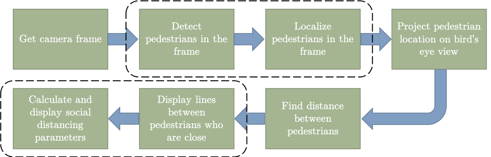

# SocialDistancingAI
Using python, deep learning and computer vision to monitor social distancing.

## Run the project
```
cd SocialDistancingAI
python main.py --videopath "vid_short.mp4"
```
Running main.py will open a window of the first frame in the video. At this point the code expects the user to mark 6 points by clicking appropriate positions on the frame.

#### Last 2 points:
The last two points are used to mark two points 6 feet apart in the region of interest. For example this could be a person's height (easier to mark on the frame)

The gif below will help understand the points better


## How does it work?
The complete block diagram of the algorithm can be seen below.

